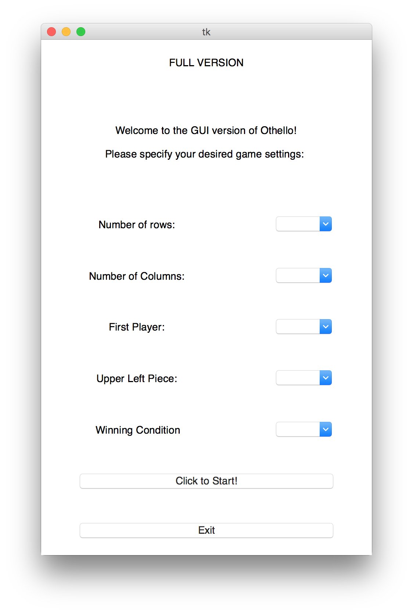
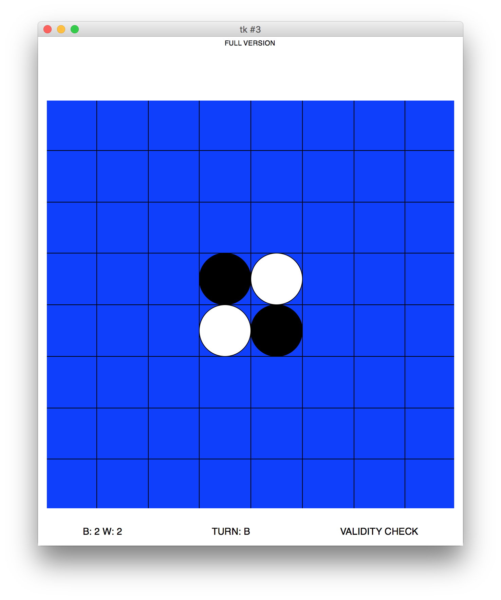
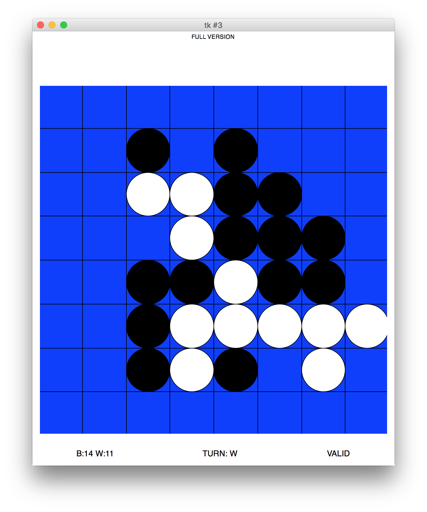

# othello_gui
GUI version of the classic game othello (aka reversi), created with Python using the built-in tkinter module.

Save all files into the same folder, run the ' start_screen.py ' module to start the game.

Details of the rules can be found at: https://en.wikipedia.org/wiki/Reversi

Here is what you will see when you run ' start_screen.py ' :

The first screen allows you to choose the options for the game.

When you finished selecting the options, game will start.

Enjoy the game!
